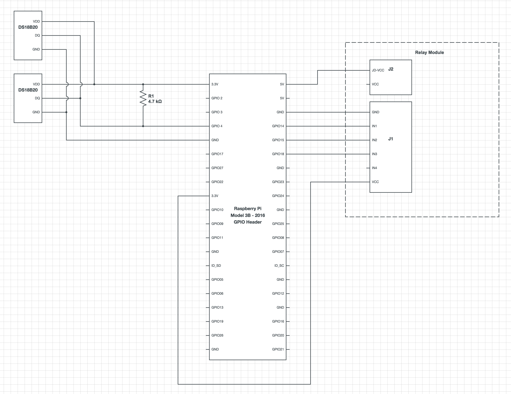
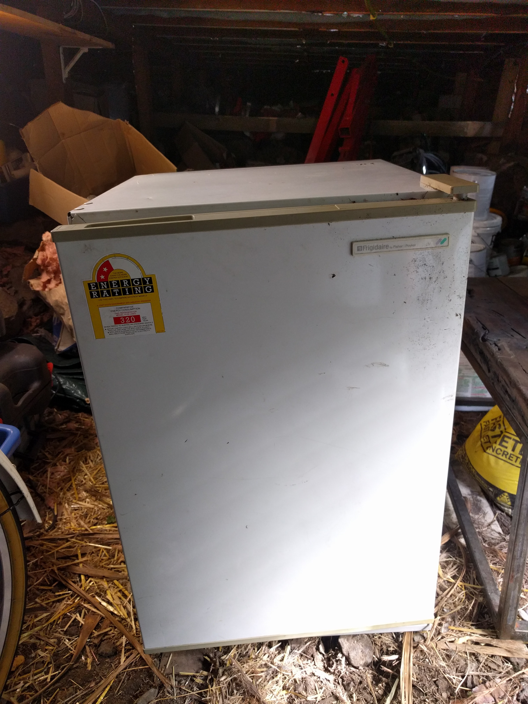

#IoT Brew Fridge

## Goal

Build an IoT brewing setup as cheaply as possible using [serverless computing](https://en.wikipedia.org/wiki/Serverless_computing).

## Architecture

Raspberry Pi acts as IoT device running the [AWS IoT Node.js library](https://github.com/aws/aws-iot-device-sdk-js/blob/master/README.md). Temperature readings are published to AWS and recorded in DynamoDB. IoT messages sent to brew-fridge to set desired temperature. AWS Lambda function subscribed to temperature readings and updates temp over time to match desired temperature profile.

## Components

- [4 channel relay module](http://www.hotmcu.com/4channel-relay-module10a-p-280.html) $10
- 2 x [one wire temp sensors](http://datasheets.maximintegrated.com/en/ds/DS18B20.pdf) $9
- Frigidaire FP120 Fridge - Literally found in bushes while walking to work - Free
- Fermenting barrel - Bob gave it to me - Free
- Raspberry Pi - From the electronics bin - Free

## Schematic

