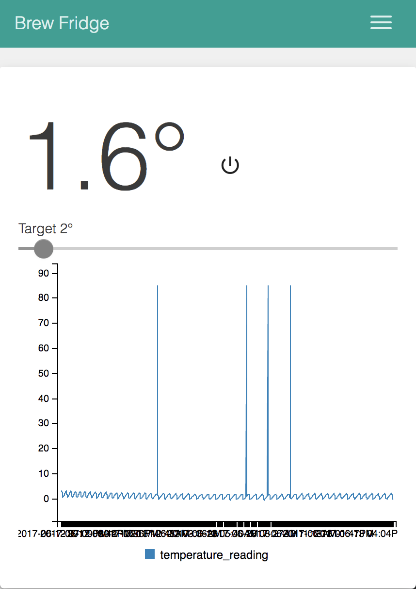

# Brew Fridge Controller

A cloud based temperature controller for your brew fridge.

## Installation

Wire up your temperature sensor and optional relays and run:

    npm install -g brew-fridge
    
    npm brew-fridge
    
The fridge will then detect your temperature sensors and register itself on [brewfridge.mclellan.org.nz](brewfridge.mclellan.org.nz):

    $ brew-fridge
    
    Registered new node, go to http://brewfridge.mclellan.org.nz/claim-node/b1f85ed9-78a7-40e0-b695-be3c0fd8a95b
    
Open the URL in your browser and the new node will be added to your account and allow setting the temperature from any web browser.

## Wiring

Any Linux device with GPIO should work e.g Raspberry Pi, C.H.I.P. or BeagleBone. 

The only requirement is wiring up a temperature sensor, typically you'll also wire in a relay board to control the fridge compressor and possibly a heat-pad. 

- [4 channel relay module](http://www.hotmcu.com/4channel-relay-module10a-p-280.html) ~$10
- [DS18B20 temperature sensors](http://datasheets.maximintegrated.com/en/ds/DS18B20.pdf) ~$4

## Developing

The project has three components; the `daemon` which senses can controls the fridge temperature, the `dashboard` which is is the user interface to set the target temperature, and the `lambda` functions which define the JSON APIs the `daamon` and `dashboard` communicate with.

You can use the webpack development server by running:

    node_modules/.bin/webpack-dev-server --open
    
To run tests:

    grunt test
    
To deploy the dashboard web interface to AWS:

    grunt deploy
    
Or to deploy the serverless Lambda functions to AWS:

    serverless deploy

## References

- [Quick start using 1-wire temp sensors](https://learn.adafruit.com/adafruits-raspberry-pi-lesson-11-ds18b20-temperature-sensing/ds18b20)
- [Node.js GPIO](https://www.sitepoint.com/getting-started-with-the-raspberry-pi-gpio-pins-in-node-js/)
- [AWS Serverless apps with Node.js](https://blog.fugue.co/2016-05-05-architecting-a-serverless-web-application-in-aws.html)

